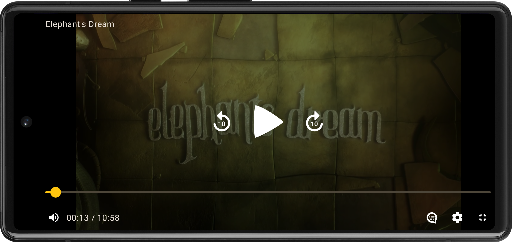

# THEOplayer Open Video UI for Android

A component library for building a world-class video player experience powered by the [THEOplayer Android SDK](https://www.theoplayer.com/product/theoplayer).

- Use the default UI for a great out-of-the-box experience, or use the individual components to build your own custom UI.
- Built using [Jetpack Compose](https://developer.android.com/jetpack/compose), for a modern and fast Android UI development experience.
- Easy to customize: [slot-based layouts](https://developer.android.com/jetpack/compose/layouts/basics#slot-based-layouts) and [theme-aware components](https://developer.android.com/jetpack/compose/designsystems/custom) empower you to truly make your player UI your own.

> **Note**
> This project is under active development. While we believe it's ready for use in production, not all features are available in this first release. If you find a problem or have an idea for a new feature, don't hesitate to [open an issue](https://github.com/THEOplayer/android-ui/issues)!



## Motivation

THEOplayer Android SDK version 4.x comes with a built-in UI based on [video.js](https://github.com/videojs/video.js) running within a `WebView` inside of a [`THEOplayerView`](https://docs.theoplayer.com/api-reference/android/com/theoplayer/android/api/THEOplayerView.html). This new UI aims to solve some limitations from the old approach:

- Built for Android. With the old UI, you would effectively use web technologies to customize your player, which feels disconnected from the rest of your Android app. With the new UI, you get a truly native UI that can take full advantage of the Android platform.
- Designed with customization in mind. With the old UI, customizing anything beyond changing some text and icon colors was difficult, and could break in unpredictable ways when updating to a new THEOplayer version. With the new UI, all components can be customized in a variety of ways with a well-documented API.
- Developed in the open. Although the old UI is based on the open-source video.js library, any custom components bundled with THEOplayer remained closed-source. With the new UI, the source code of all components is publicly available. Advanced users can learn about the inner workings of each component, modify them, and even contribute their changes back to Open Video UI.

## Installation

1. Create a new Jetpack Compose app or set up Compose in your existing Android app by following [the Compose quick start guide](https://developer.android.com/jetpack/compose/setup).
1. Add the native THEOplayer Android SDK to your project by following [these installation instructions](https://github.com/THEOplayer/theoplayer-sdk-android#installation).
1. Add the THEOplayer Maven repository to your project-level `settings.gradle` file:
    ```groovy
    dependencyResolutionManagement {
        repositories {
            google()
            mavenCentral()
            maven { url = uri("https://jitpack.io") }
            maven { url = uri("https://maven.theoplayer.com/releases") }
        }
    }
    ```
   Alternatively, you can use the GitHub Packages mirror.
   <details>
   <summary>GitHub Packages setup</summary>
   
   1. [Add GitHub Packages as a Maven repository](https://docs.github.com/en/packages/working-with-a-github-packages-registry/working-with-the-gradle-registry#using-a-published-package) to your project-level `settings.gradle` file:
      ```groovy
      dependencyResolutionManagement {
          repositories {
              google()
              mavenCentral()
              maven { url = uri("https://jitpack.io") }
              maven {
                  url = uri("https://maven.pkg.github.com/THEOplayer/android-ui")
                  credentials {
                      // Define gpr.user and gpr.key preferably in your local ~/.gradle/gradle.properties
                      username = (settings.ext.has("gpr.user")) ? settings.ext["gpr.user"] : System.getenv("USERNAME")
                      password = (settings.ext.has("gpr.key")) ? settings.ext["gpr.key"] : System.getenv("TOKEN")
                  }
              }
          }
      }
      ```
   1. [Authenticate with GitHub Packages](https://docs.github.com/en/packages/working-with-a-github-packages-registry/working-with-the-gradle-registry#authenticating-to-github-packages), and save your username and access token in `~/.gradle/gradle.properties`:
      ```
      gpr.user=YOUR_USERNAME
      gpr.key=YOUR_ACCESS_TOKEN
      ```
   
   </details>
1. Add Open Video UI as a dependency in your module-level `build.gradle` file:
    ```groovy
    dependencies {
        implementation "com.theoplayer.theoplayer-sdk-android:core:5.+"
        implementation "com.theoplayer.android-ui:android-ui:1.+"
    }
    ```

## Usage

### Default UI

`DefaultUI` provides a fully-featured video player experience with minimal setup.

```kotlin
import android.os.Bundle
import androidx.activity.ComponentActivity
import androidx.activity.compose.setContent
import com.theoplayer.android.api.THEOplayerConfig
import com.theoplayer.android.api.source.SourceDescription
import com.theoplayer.android.ui.DefaultUI
import com.theoplayer.android.ui.theme.THEOplayerTheme

class MainActivity : ComponentActivity() {
    override fun onCreate(savedInstanceState: Bundle?) {
        super.onCreate(savedInstanceState)

        setContent {
            THEOplayerTheme(useDarkTheme = true) {
                DefaultUI(
                    config = THEOplayerConfig.Builder().build(),
                    source = SourceDescription.Builder("https://cdn.theoplayer.com/video/big_buck_bunny/big_buck_bunny.m3u8")
                        .build(),
                    title = "Big Buck Bunny"
                )
            }
        }
    }
}
```

See [the demo app](https://github.com/THEOplayer/android-ui/blob/main/app/src/main/java/com/theoplayer/android/ui/demo/MainActivity.kt) for a complete and working example.

### Custom UI

If you want to fully customize your video player layout, you can use a `UIController` instead.

```kotlin
setContent {
    UIController(
        config = THEOplayerConfig.Builder().build(),
        source = SourceDescription.Builder("https://cdn.theoplayer.com/video/big_buck_bunny/big_buck_bunny.m3u8")
            .build(),
        // Choose your own layout using the provided components (or your own!)
        bottomChrome = {
            SeekBar()
            Row {
                PlayButton()
                MuteButton()
                Spacer(modifier = Modifier.weight(1f))
                FullscreenButton()
            }
        }
    )
}
```
